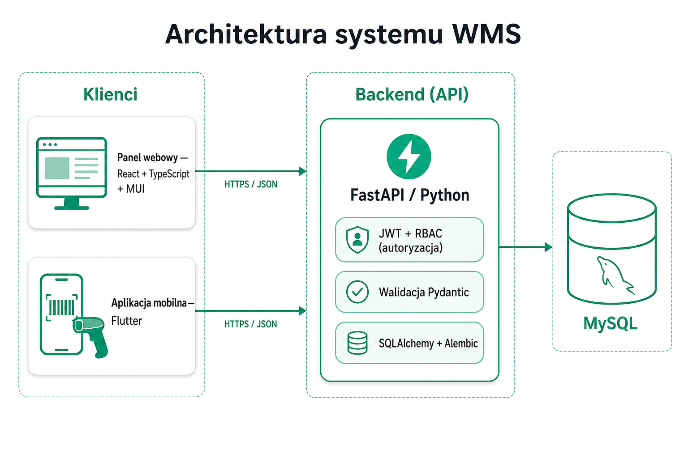
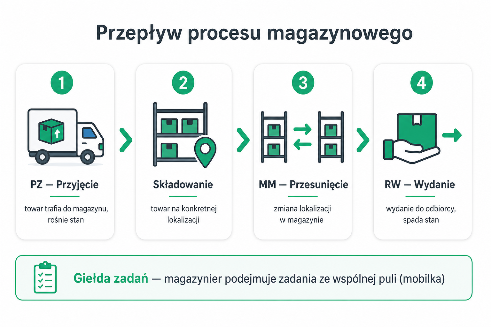
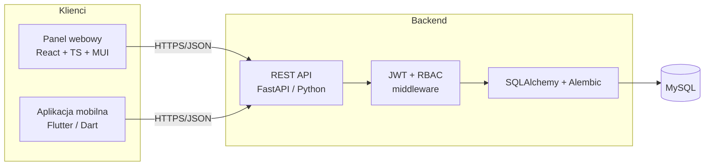

# Skrypt obrony pracy inżynierskiej — System WMS

**Cel dokumentu:** żeby każdy członek zespołu wiedział, *co* zbudowaliśmy, *dlaczego* wybraliśmy daną technologię i *jak* odpowiedzieć na pytania promotora oraz recenzenta.

**Zespół i zakres odpowiedzialności:**
- **Jakub Rzepkowski** — backend (FastAPI, API, baza, bezpieczeństwo) + aplikacja mobilna (Flutter).
- **Miłosz Marek** — frontend web (React, TypeScript, Vite, MUI).
- **Grzegorz Pawlak** — jakość i dokumentacja: testy manualne, ryzyka, raporty UAT/GO-NO-GO, analiza porównawcza.

> Zasada na obronie: mówimy **krótko i konkretnie**, każdą decyzję uzasadniamy **wymaganiem** (a nie modą). Jeśli czegoś nie zrobiliśmy — mówimy wprost „świadomie poza zakresem MVP, jest w planie rozwoju”.

---

## 1. Streszczenie projektu (30 sekund — „elevator pitch”)

> „Zbudowaliśmy system WMS (Warehouse Management System) do zarządzania magazynem. Składa się z trzech części: **API (FastAPI/Python)**, **panelu webowego (React)** dla kierownika/administratora oraz **aplikacji mobilnej (Flutter)** dla magazyniera. System obsługuje pełny obieg dokumentów magazynowych **PZ (przyjęcie), MM (przesunięcie), RW (wydanie)**, zarządzanie stanami wg lokalizacji, **giełdę zadań** dla pracowników, **role i uprawnienia (RBAC)** oraz raporty. Dane trzymamy w **MySQL**, dostęp zabezpieczamy **tokenami JWT**.”

---

## 2. Architektura — jak to działa (diagram)

> Powyższe grafiki (`docs/grafiki/`) są gotowe do wstawienia do prezentacji i dokumentacji.

**Przepływ danych (jedno zdanie):** klient (web/mobilka) wysyła żądanie HTTP z tokenem JWT → API sprawdza token i uprawnienia (RBAC) → warstwa ORM (SQLAlchemy) wykonuje operacje na MySQL → odpowiedź wraca jako JSON.

**Dlaczego warstwowo (klient ↔ API ↔ baza)?** Rozdzielenie odpowiedzialności: jedna logika biznesowa w API obsługuje *zarówno* web, *jak i* mobilkę. Nie duplikujemy reguł magazynowych w dwóch miejscach.

---

## 3. Uzasadnienie technologii (najważniejsza część obrony)

Dla każdej technologii: **co to jest → dlaczego my → alternatywy → trade-off**.

### 3.1. Backend: FastAPI (Python)
- **Co:** nowoczesny framework do budowy REST API w Pythonie.
- **Dlaczego:** automatyczna **walidacja danych** (Pydantic), **auto-dokumentacja API** (Swagger/OpenAPI pod `/api/docs`), wysoka wydajność (async), niski próg wejścia, ogromne wsparcie społeczności.
- **Alternatywy:** Django REST Framework (cięższy, „baterie w zestawie”, wolniejszy start), Flask (minimalistyczny, ale trzeba doklejać walidację i dokumentację ręcznie), Node/Express (inny ekosystem).
- **Trade-off:** FastAPI nie ma wbudowanego ORM ani panelu admina jak Django — dobraliśmy je osobno (SQLAlchemy), co dało nam większą kontrolę.

### 3.2. Walidacja: Pydantic
- **Co:** biblioteka do walidacji i serializacji danych w oparciu o typy Pythona.
- **Dlaczego:** każdy request jest walidowany **zanim** dotknie logiki (np. ilość > 0, poprawny format loginu 5 cyfr). Mniej błędów, czytelne komunikaty.

### 3.3. Baza danych: MySQL
- **Co:** relacyjna baza danych SQL.
- **Dlaczego:** dane magazynowe są **silnie relacyjne** (produkt ↔ lokalizacja ↔ stan ↔ dokument ↔ zadanie) i wymagają **spójności transakcyjnej** (ACID) — np. wydanie towaru musi atomowo zmniejszyć stan i zapisać ruch. Relacyjna baza to naturalny wybór.
- **Alternatywy:** PostgreSQL (równie dobry, wybór zespołu / znajomość narzędzia), MongoDB (NoSQL — odpada, bo nasze dane są relacyjne i potrzebujemy spójności).
- **Trade-off:** sztywny schemat — ale w magazynie to **zaleta** (integralność danych).

### 3.4. ORM: SQLAlchemy + migracje Alembic
- **Co:** SQLAlchemy mapuje tabele na klasy Pythona; Alembic wersjonuje zmiany schematu bazy.
- **Dlaczego:** piszemy logikę w Pythonie (czytelniej, bezpieczniej — ochrona przed **SQL Injection** przez parametryzację), a Alembic pozwala **odtworzyć/zmienić** strukturę bazy w kontrolowany sposób (jak „git dla schematu bazy”).

### 3.5. Frontend web: React + TypeScript + Vite + MUI
- **React:** komponentowy, najpopularniejszy → łatwo znaleźć materiały i rozwijać.
- **TypeScript:** typy łapią błędy **na etapie pisania kodu**, a nie w trakcie działania — kluczowe w aplikacji biznesowej.
- **Vite:** bardzo szybki bundler/dev-server (natychmiastowy hot-reload).
- **MUI (Material UI):** gotowa, spójna biblioteka komponentów (tabele, formularze, dialogi) → szybciej budujemy profesjonalny, dostępny UI.
- **Alternatywy:** Angular (cięższy, większy narzut), Vue (mniejszy ekosystem w naszym otoczeniu).

### 3.6. Aplikacja mobilna: Flutter (Dart)
- **Co:** framework Google do aplikacji mobilnych z **jednego kodu** na iOS i Android.
- **Dlaczego:** magazynier pracuje „w ruchu” (skan kodów, lista zadań). Flutter daje natywną wydajność i jeden kod na obie platformy — przy małym zespole to oszczędność czasu.
- **Alternatywy:** natywne (Swift + Kotlin osobno — 2× pracy), React Native (słabsza wydajność przy skanerze/animacjach).
- **Kluczowa funkcja:** skanowanie kodów kreskowych (biblioteka `mobile_scanner`).

### 3.7. Autoryzacja: JWT (access + refresh) + RBAC
- **JWT:** token podpisany kryptograficznie; po zalogowaniu klient dołącza go do każdego żądania. Serwer nie musi trzymać sesji w pamięci (skalowalność).
- **RBAC (Role-Based Access Control):** 4 role — **ADMIN, MANAGER, FOREMAN, WORKER** — każda ma zdefiniowany poziom dostępu do obszarów (macierz uprawnień w backendzie).
- **Dlaczego dwa tokeny:** krótki *access* (30 min) ogranicza skutki wycieku; długi *refresh* (7 dni) pozwala odnowić sesję bez ponownego logowania.

### 3.8. Konteneryzacja: Docker / Docker Compose
- **Co:** pakujemy backend i bazę w kontenery; Compose uruchamia je jedną komendą.
- **Dlaczego:** „**działa u mnie = działa wszędzie**” — identyczne środowisko na każdym komputerze i na serwerze. Ułatwia wdrożenie w chmurze.

### 3.9. Testy: pytest, Vitest, Playwright, Flutter integration, benchmark
- Wielopoziomowo: jednostkowe (logika), integracyjne API, E2E web, integracyjne mobilki, test wydajności. (Szczegóły w sekcji 6.)

---

## 4. Najczęstsze pytania promotora/recenzenta + wzorcowe odpowiedzi

### A. Pytania o architekturę i decyzje

**P: Dlaczego rozdzieliliście backend i frontend, zamiast jednej aplikacji?**
> Bo z jednego API korzystają **dwa różne klienty** — panel web i mobilka. Logika magazynowa (np. reguły wydania) jest w jednym miejscu, więc nie ma ryzyka rozjazdu między platformami. Dodatkowo można rozwijać i wdrażać warstwy niezależnie.

**P: Dlaczego REST, a nie GraphQL?**
> Nasze operacje to klasyczny CRUD na zasobach (dokumenty, stany, zadania) z jasno określonymi ścieżkami. REST jest prostszy, lepiej cache'owalny i wystarczający dla zakresu. GraphQL miałby sens przy bardzo złożonych, zmiennych zapytaniach z wielu źródeł — u nas to nadmiarowa złożoność.

**P: Jak zapewniacie spójność stanów magazynowych przy równoczesnej pracy web i mobilki?**
> Operacje krytyczne wykonujemy w **transakcjach bazodanowych** z blokadą wiersza (`SELECT ... FOR UPDATE`), więc dwie osoby nie zdejmą tego samego towaru dwa razy. Dodatkowo używamy **optimistic locking** (pole `version` na rekordach), a UI odświeża dane po każdej operacji oraz cyklicznie.

**P: Co to jest „giełda zadań”?**
> Zadania (np. odłożenie, kompletacja) tworzone są jako **nieprzypisane (status NEW)** i trafiają do wspólnej puli. Dowolny magazynier może je „podjąć” (wtedy zadanie przypisuje się do niego). Dzięki temu nieobecność jednej osoby nie blokuje pracy — to odwzorowuje realny magazyn.

### B. Pytania o bazę danych

**P: Pokażcie model danych / dlaczego taki schemat?**
> Główne encje: `users`, `products`, `locations`, `stock` (stan = produkt + lokalizacja + status + ilość), `documents` + `document_items`, `tasks`, `stock_ledger` (księga ruchów), `audit_log`. Rozdzielenie `stock` per lokalizacja pozwala wiedzieć **gdzie dokładnie** leży towar, a `stock_ledger` daje pełną historię ruchów (audytowalność).

**P: Jak chronicie się przed SQL Injection?**
> Nie sklejamy zapytań ze stringów — korzystamy z **ORM (SQLAlchemy)**, który parametryzuje zapytania. Dane wejściowe są dodatkowo walidowane przez Pydantic.

**P: Co z migracjami przy zmianie schematu?**
> Używamy **Alembic** — każda zmiana schematu to wersjonowana migracja, którą można zastosować lub cofnąć. Migracje uruchamiają się automatycznie przy starcie aplikacji.

### C. Pytania o bezpieczeństwo (patrz też dokument: `TESTY_LIGHTHOUSE_I_BEZPIECZENSTWA_WMS.md`)

**P: Jak przechowujecie hasła?**
> Nigdy jawnie. Hashujemy algorytmem **bcrypt** (z solą). W bazie jest tylko hash. Mamy też politykę haseł (min. długość, litera + cyfra).

**P: Jak działa logowanie i co po zbyt wielu próbach?**
> Logowanie zwraca **JWT**. Po `MAX_LOGIN_ATTEMPTS` nieudanych próbach konto jest **czasowo blokowane** (ochrona przed brute-force). Komunikat błędu jest **generyczny** („Nieprawidłowy login lub hasło”), żeby nie zdradzać, czy konto istnieje (ochrona przed enumeracją użytkowników).

**P: Jakie zabezpieczenia ma samo API?**
> 1) **JWT + RBAC** (autoryzacja per obszar i rola), 2) **walidacja wejścia** (Pydantic), 3) **nagłówki bezpieczeństwa** (X-Frame-Options, X-Content-Type-Options, Content-Security-Policy, Referrer-Policy, Permissions-Policy, opcjonalnie HSTS za HTTPS), 4) **CORS** ograniczony do znanych originów, 5) **TrustedHost** i opcjonalny **rate-limit** w produkcji, 6) **audit log** każdej istotnej operacji, 7) ukrywanie szczegółów błędów 500 w produkcji.

**P: Czy aplikacja jest w pełni bezpieczna?**
> Wdrożyliśmy zabezpieczenia **podstawowego i średniego poziomu** adekwatne do projektu inżynierskiego i potwierdzone darmowymi skanerami (securityheaders.com, Mozilla Observatory). Pełny audyt (np. pentest, WAF, 2FA) to element planu rozwoju przy wdrożeniu produkcyjnym — świadomie poza zakresem MVP.

### D. Pytania o testy i jakość

**P: Jak testowaliście system?**
> Wielopoziomowo: **jednostkowe** (walidatory, uprawnienia, maszyna stanów), **integracyjne API** (pełne PZ/MM/RW, RBAC), **E2E web** (Playwright + zrzuty), **integracyjne mobilki** (Flutter), oraz **test wydajnościowy** (benchmark do 50 równoległych użytkowników). Do tego scenariusze **manualne (UAT)** z raportem GO/NO-GO.

**P: Jakie były wyniki wydajności?**
> Po tuningu: **0% błędów do 25 równoległych użytkowników**, P95 (95. percentyl czasu odpowiedzi) ok. **321 ms**. Powyżej 25 użytkowników rośnie odsetek błędów — to temat na skalowanie infrastruktury (więcej workerów, pula połączeń, cache).

### E. Pytania o wdrożenie

**P: Czy aplikacja jest wdrożona w chmurze?**
> Przygotowaliśmy **kompletną konfigurację wdrożeniową** (Docker Compose produkcyjny, reverse proxy z HTTPS, zmienne środowiskowe, build frontu) opisaną w `WDROZENIE_CHMURA_WMS.md`. Wdrożenie na VPS/chmurę sprowadza się do uruchomienia tej konfiguracji i podpięcia domeny — kwestia konta i decyzji o dostawcy.

### F. Pytania „podchwytliwe” / o ograniczenia

**P: Co byście zrobili inaczej / co jest słabością?**
> Mocna strona: spójna logika dla web i mobilki, audytowalność, role. Do poprawy: synchronizacja w czasie rzeczywistym (dziś polling/odświeżanie po zdarzeniu — docelowo WebSocket/SSE), skalowanie powyżej 25 użytkowników, pełny CI/CD. To świadome decyzje zakresu MVP, mamy je w planie rozwoju.

**P: Skąd wiecie, że to działa „naprawdę”, a nie tylko na slajdach?**
> Mamy **dowody**: raporty E2E/UAT, zrzuty ekranów z przejścia całego procesu, wyniki benchmarku i scenariusze testów manualnych z wynikami PASS/FAIL.

---

## 5. Podział „kto odpowiada na co” (na obronie)

| Obszar pytania | Kto prowadzi odpowiedź | Wsparcie |
|---|---|---|
| Architektura ogólna, API, baza, bezpieczeństwo | Jakub | Miłosz |
| Aplikacja mobilna (Flutter, skaner, flow magazyniera) | Jakub | — |
| Frontend web, UX, komponenty, walidacja formularzy | Miłosz | Jakub |
| Testy, jakość, ryzyka, scenariusze UAT, porównanie z konkurencją | Grzegorz | wszyscy |
| Metodologia pracy, harmonogram, podział zadań | Grzegorz | Miłosz |

> Każdy powinien znać **streszczenie (sekcja 1)** i **architekturę (sekcja 2)** — to pytania „do każdego”.

---

## 6. Ściąga pojęć (gdyby padło „proszę wyjaśnić”)

- **API REST** — zestaw adresów HTTP do operacji na danych (GET/POST/PUT/DELETE).
- **JWT** — podpisany token potwierdzający tożsamość; nie da się go podrobić bez klucza serwera.
- **RBAC** — kontrola dostępu na podstawie roli użytkownika.
- **ORM** — mapowanie tabel bazy na obiekty w kodzie.
- **Migracja** — wersjonowana zmiana struktury bazy.
- **CORS** — mechanizm przeglądarki kontrolujący, które domeny mogą wołać API.
- **bcrypt** — algorytm haszowania haseł odporny na szybkie łamanie.
- **P95** — wartość, poniżej której mieści się 95% czasów odpowiedzi (miara „typowo najgorszego” doświadczenia).
- **PZ / MM / RW** — przyjęcie zewnętrzne / przesunięcie międzymagazynowe / rozchód wewnętrzny (wydanie).
- **Optimistic locking** — wykrywanie konfliktu edycji przez numer wersji rekordu.

---

## 7. Checklisty na dzień obrony

**Techniczne:**
- [ ] Backend uruchomiony (`/api/health` zwraca `ok`).
- [ ] Frontend uruchomiony i połączony z API.
- [ ] Konta demo działają (ADMIN, WORKER).
- [ ] Telefon z aplikacją w tej samej sieci (lub nagranie demo jako backup).
- [ ] Otwarte: `/api/docs` (Swagger), panel web, mobilka.

**Materiały:**
- [ ] Ten skrypt (sekcja 1–4) przerobiony przez każdego.
- [ ] Prezentacja `PREZENTACJA_GRUPA36_uzupelniona.pptx`.
- [ ] Raporty testów + wyniki benchmarku pod ręką.
- [ ] Dokument bezpieczeństwa i wdrożenia jako dowód „dorobiliśmy wytyczne”.
