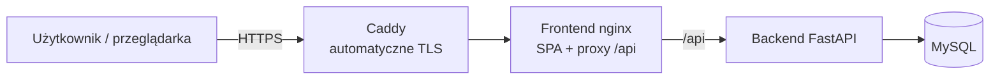

# Wdrożenie WMS w chmurze / na hostingu

Dokument opisuje, jak uruchomić system produkcyjnie. Cała konfiguracja jest gotowa w repozytorium — wdrożenie sprowadza się do skopiowania sekretów, ustawienia domeny i jednej komendy.

## Co składa się na wdrożenie



Pliki użyte do wdrożenia (wszystkie w repo):
- `docker-compose.prod.yml` — definicja całego stacku produkcyjnego.
- `frontend/Dockerfile` + `frontend/nginx.conf` — build SPA i serwowanie + nagłówki bezpieczeństwa + proxy `/api`.
- `backend/Dockerfile` — obraz API.
- `Caddyfile` — reverse proxy z **automatycznym HTTPS** (Let's Encrypt).
- `.env.prod.example` — szablon sekretów.

## Wariant zalecany na obronę: VPS + Docker (najprostszy, najtańszy)

Dowolny tani VPS (np. **Hetzner**, **DigitalOcean**, **Mikr.us**, **OVH**) z Ubuntu 22.04. To samo zadziała na maszynie w chmurze AWS EC2 / Azure VM / GCP Compute.

### Krok po kroku

1. **Domena → serwer.** W panelu domeny ustaw rekord **A** wskazujący na publiczne IP serwera (np. `wms.twojadomena.pl → 203.0.113.10`).

2. **Na serwerze zainstaluj Docker:**
   ```bash
   curl -fsSL https://get.docker.com | sh
   ```

3. **Pobierz projekt i przygotuj sekrety:**
   ```bash
   git clone <adres-repo> wms && cd wms
   cp .env.prod.example .env.prod
   nano .env.prod        # ustaw PUBLIC_DOMAIN, hasła, JWT_SECRET_KEY
   ```
   Klucz JWT wygeneruj:
   ```bash
   openssl rand -hex 32
   ```

4. **Uruchom:**
   ```bash
   docker compose -f docker-compose.prod.yml --env-file .env.prod up -d --build
   ```

5. **Gotowe.** Po chwili (Caddy pobiera certyfikat) wejdź na `https://wms.twojadomena.pl`.
   Sprawdzenie API: `https://wms.twojadomena.pl/api/health` → `{"status":"ok"}`.

### Aktualizacja po zmianach w kodzie
```bash
git pull
docker compose -f docker-compose.prod.yml --env-file .env.prod up -d --build
```

### Kopia zapasowa bazy
```bash
docker compose -f docker-compose.prod.yml exec db \
  mysqldump -uroot -p"$DB_ROOT_PASSWORD" wms_db > backup_$(date +%F).sql
```

## Co już jest „produkcyjnie poprawne” w tej konfiguracji

- **HTTPS** automatyczny (Caddy + Let's Encrypt), z przekierowaniem 80→443.
- **Baza nie jest wystawiona** na internet (brak publicznych portów — dostęp tylko w sieci dockerowej).
- **Backend nie jest wystawiony** bezpośrednio — ruch tylko przez frontend (proxy).
- **Sekrety w `.env.prod`** (poza repo, w `.gitignore`), nie w kodzie.
- **DEBUG=false**, **HSTS=true**, **rate-limit 120/min**, **CORS** ograniczony do domeny, **TrustedHost** ustawiony.
- **Nagłówki bezpieczeństwa** na froncie i w API.

## Warianty alternatywne (gdyby promotor pytał o „chmurę zarządzaną”)

| Element | Usługa zarządzana (PaaS) |
|---|---|
| Baza MySQL | AWS RDS / Azure Database for MySQL / DigitalOcean Managed DB |
| Backend (kontener) | AWS ECS/App Runner, Azure Container Apps, Google Cloud Run |
| Frontend (statyki) | Netlify / Vercel / AWS S3+CloudFront |

> Przy PaaS wystarczy ustawić `DATABASE_URL` na bazę zarządzaną oraz `VITE_API_URL` na adres backendu. Reszta konfiguracji (Dockerfile) pozostaje ta sama.

## Co wymaga decyzji/działania zespołu (nie da się zautomatyzować z kodu)
- Wykupienie VPS lub konta w chmurze (płatne, wymaga karty).
- Zakup/konfiguracja domeny + rekord DNS A.
- Uzupełnienie realnych sekretów w `.env.prod`.

> Na obronę wystarczy pokazać działającą konfigurację lokalnie (`docker compose -f docker-compose.prod.yml ...` z `PUBLIC_DOMAIN=localhost`) lub jednorazowe wdrożenie na tanim VPS jako dowód.
