# Dokumentacja ról i uprawnień — System WMS

Dokument przedstawia, do czego ma dostęp każda rola użytkownika i co może w systemie zrobić. Każda rola została **przetestowana end‑to‑end** w panelu webowym: zalogowano się na osobne konto, przeklikano dostępne moduły i wykonano próby wejścia w obszary zastrzeżone. Wszystkie zrzuty pochodzą z działającej aplikacji.

## Jak przeprowadzono test (metodyka)

- Uruchomiono backend (FastAPI) + bazę MySQL + panel web (React).
- Zalogowano się kolejno na konto **każdej z 4 ról** i:
  1. otwarto menu nawigacji → zrzut listy dostępnych modułów,
  2. wejście w kluczowe ekrany danej roli → zrzut,
  3. próba wejścia w adres modułu zastrzeżonego (np. `/settings`, `/users`, `/inventory`) → system **przekierowuje na Pulpit** (dowód blokady).
- Zgodność potwierdzono **dwustronnie**: blokady działają zarówno w interfejsie (menu/`RoleGuard`), jak i na **backendzie** (`require_permission`/`require_roles` zwraca 403). Frontend i backend korzystają z **tej samej macierzy uprawnień**.

> Uwaga o wyglądzie zrzutów: panel jest responsywny (RWD). W oknie testowym renderował się w widoku kompaktowym (mobilnym) z dolnym paskiem nawigacji i rozwijanym menu „Więcej”. Na szerokim monitorze ten sam panel pokazuje boczne menu — funkcje i uprawnienia są identyczne.

## Konta testowe (role)

| Rola | Kod logowania | Hasło | Opis |
|---|---|---|---|
| **ADMIN** (Administrator) | `00001` | `MojeHasloAdmina2026!WMS` | Pełny dostęp do całego systemu |
| **MANAGER** (Kierownik) | `07821` | `Demo1234` | Zarządzanie operacjami i danymi, podgląd użytkowników |
| **FOREMAN** (Brygadzista) | `40476` | `Demo1234` | Operacje i zarządzanie zadaniami, bez administracji |
| **WORKER** (Magazynier) | `00002` | `Demo1234` | Wykonywanie zadań i operacji magazynowych |

## Poziomy uprawnień (legenda)

System używa poziomów dostępu per obszar funkcjonalny:

| Poziom | Znaczenie |
|---|---|
| `FULL` | Pełny dostęp: odczyt, tworzenie, edycja, usuwanie |
| `CREATE` | Odczyt + tworzenie |
| `OPERATIONAL` | Odczyt + wykonywanie operacji (np. potwierdzanie) |
| `EXECUTE` | Odczyt + wykonywanie (realizacja zadań/operacji) |
| `READ` | Tylko podgląd |
| `OWN` | Dostęp wyłącznie do własnych danych (np. własne raporty) |
| `NONE` | Brak dostępu |

## Macierz uprawnień (źródło prawdy w kodzie)

Poniższa macierz jest zaimplementowana identycznie w backendzie (`require_permission`) i w panelu web (`usePermissions`).

| Obszar | ADMIN | MANAGER | FOREMAN | WORKER |
|---|---|---|---|---|
| Użytkownicy (`users`) | FULL | READ | NONE | NONE |
| Konfiguracja systemu (`systemConfig`) | FULL | NONE | NONE | NONE |
| Słowniki: produkty, lokalizacje (`dictionaries`) | FULL | FULL | FULL | READ |
| Dokumenty PZ/MM/RW (`documents`) | FULL | FULL | FULL | OPERATIONAL |
| Zadania – realizacja (`tasks`) | FULL | FULL | FULL | EXECUTE |
| Zadania – zarządzanie/tworzenie (`taskManagement`) | FULL | FULL | FULL | NONE |
| Ruchy i stany (`movements`) | FULL | FULL | FULL | EXECUTE |
| Zmiana statusu towaru (`stockStatus`) | FULL | FULL | FULL | NONE |
| Inwentaryzacja (`inventory`) | FULL | FULL | OPERATIONAL | NONE |
| Raporty (`reports`) | FULL | FULL | FULL | OWN |

---

# 1. ADMIN — Administrator

**Dostęp:** pełny do wszystkich modułów. Jedyna rola z dostępem do **Ustawień systemu** i pełnego **zarządzania użytkownikami**.

**Może:**
- zarządzać użytkownikami (tworzyć, edytować, blokować konta),
- konfigurować system (sesje, polityka haseł, blokady, powiadomienia),
- prowadzić wszystkie operacje magazynowe i dokumenty (PZ/MM/RW),
- zarządzać zadaniami, inwentaryzacją, słownikami,
- generować wszystkie raporty i przeglądać dziennik zdarzeń.

### Dostępne moduły (menu administratora)

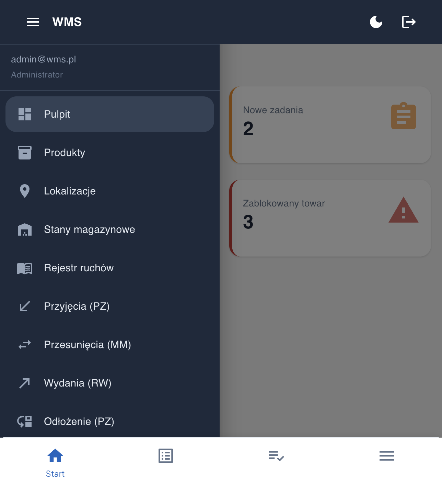

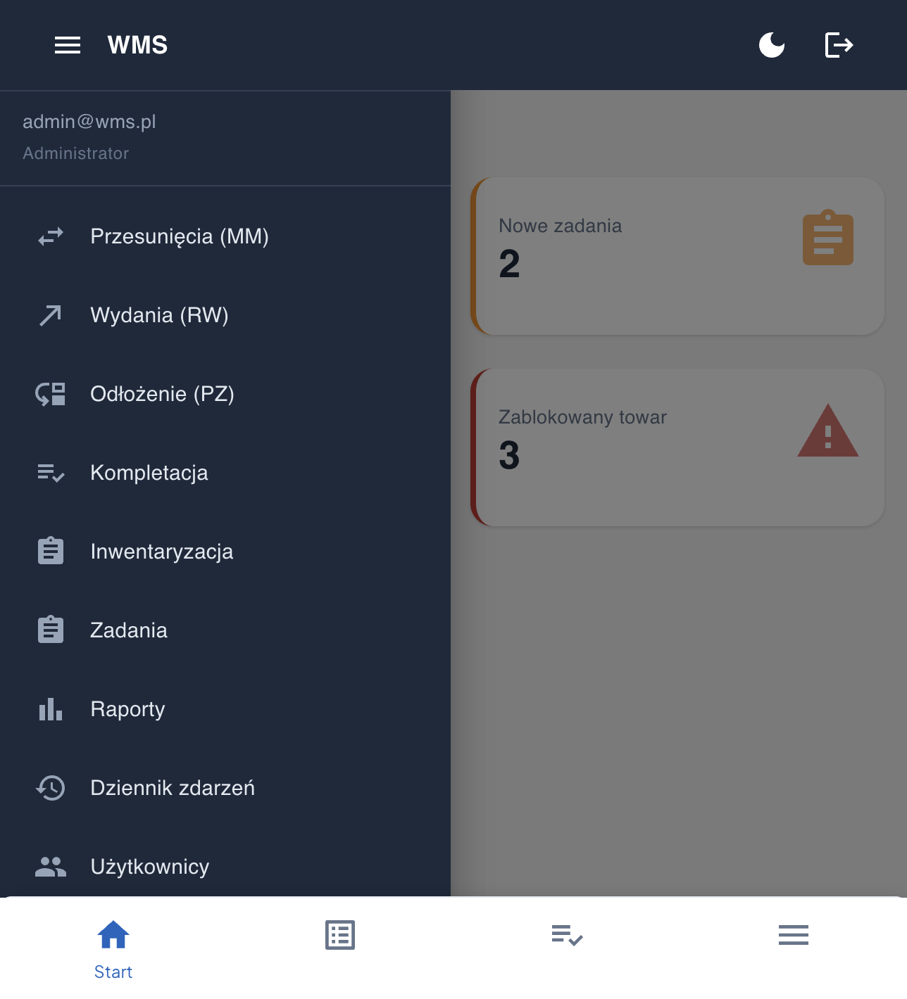

### Zarządzanie użytkownikami (`/users`) — z akcją „Utwórz konto”

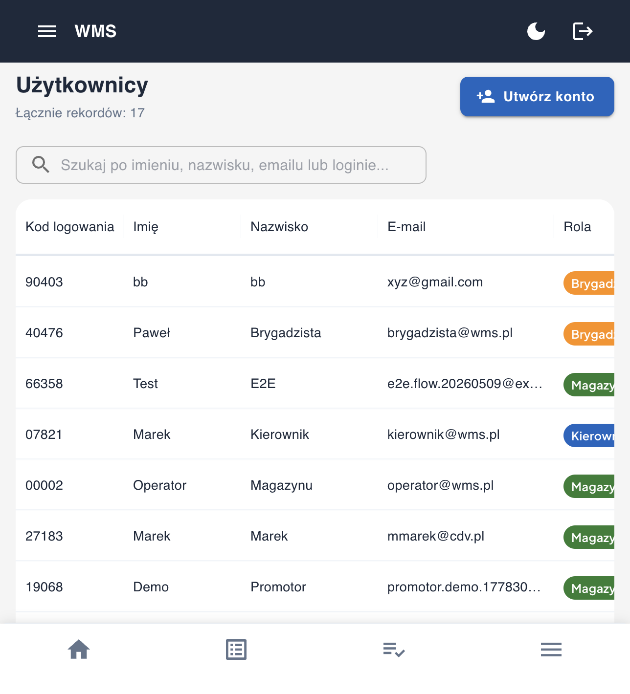

### Ustawienia systemu (`/settings`) — wyłącznie dla administratora

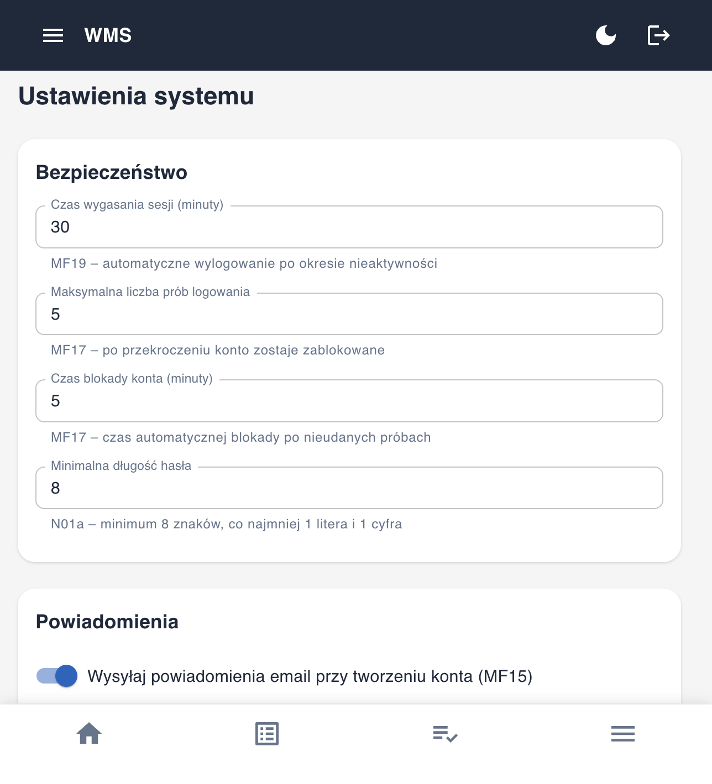

### Raporty (`/reports`)

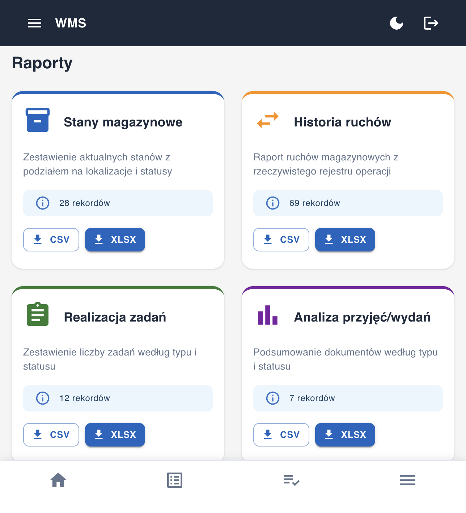

---

# 2. MANAGER — Kierownik

**Dostęp:** wszystkie moduły operacyjne i dane, **podgląd** listy użytkowników. **Bez** dostępu do Ustawień systemu.

**Może:**
- prowadzić pełne operacje: dokumenty PZ/MM/RW, stany, ruchy, słowniki,
- zarządzać zadaniami i tworzyć je, prowadzić inwentaryzację (z zatwierdzaniem),
- generować wszystkie raporty i przeglądać dziennik zdarzeń,
- **podglądać** listę użytkowników.

**Nie może:**
- tworzyć/edytować użytkowników (to akcja administratora — backend zwraca 403),
- wchodzić do Ustawień systemu.

### Dostępne moduły (menu kierownika — brak „Ustawień”)

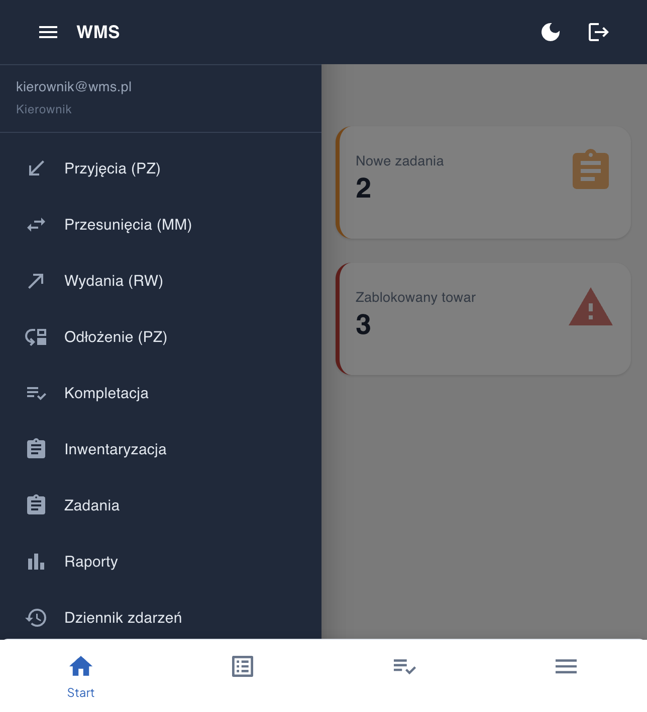

### Użytkownicy (`/users`) — podgląd listy

> Kierownik widzi listę użytkowników (poziom `READ`). Przycisk „Utwórz konto” jest widoczny w interfejsie, ale **samo utworzenie/edycja konta jest blokowane na backendzie** (wymaga poziomu `FULL` = tylko ADMIN).

### Próba wejścia w Ustawienia (`/settings`) → blokada (przekierowanie na Pulpit)

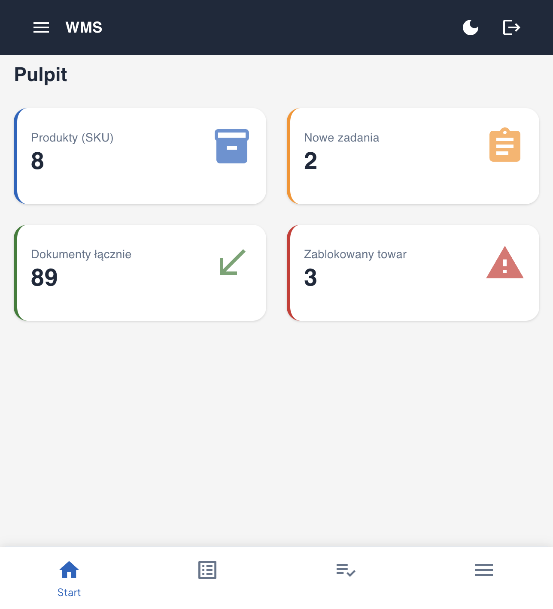

---

# 3. FOREMAN — Brygadzista

**Dostęp:** operacje magazynowe i **pełne zarządzanie zadaniami**. **Bez** dostępu do użytkowników i ustawień.

**Może:**
- prowadzić dokumenty PZ/MM/RW, stany, ruchy, słowniki,
- **tworzyć i przydzielać zadania** (przycisk „Utwórz zadanie”),
- wykonywać inwentaryzację (poziom operacyjny),
- generować raporty i przeglądać dziennik zdarzeń.

**Nie może:**
- zarządzać użytkownikami (brak modułu, wejście blokowane),
- wchodzić do Ustawień systemu.

### Dostępne moduły (menu brygadzisty — brak „Użytkownicy” i „Ustawienia”)

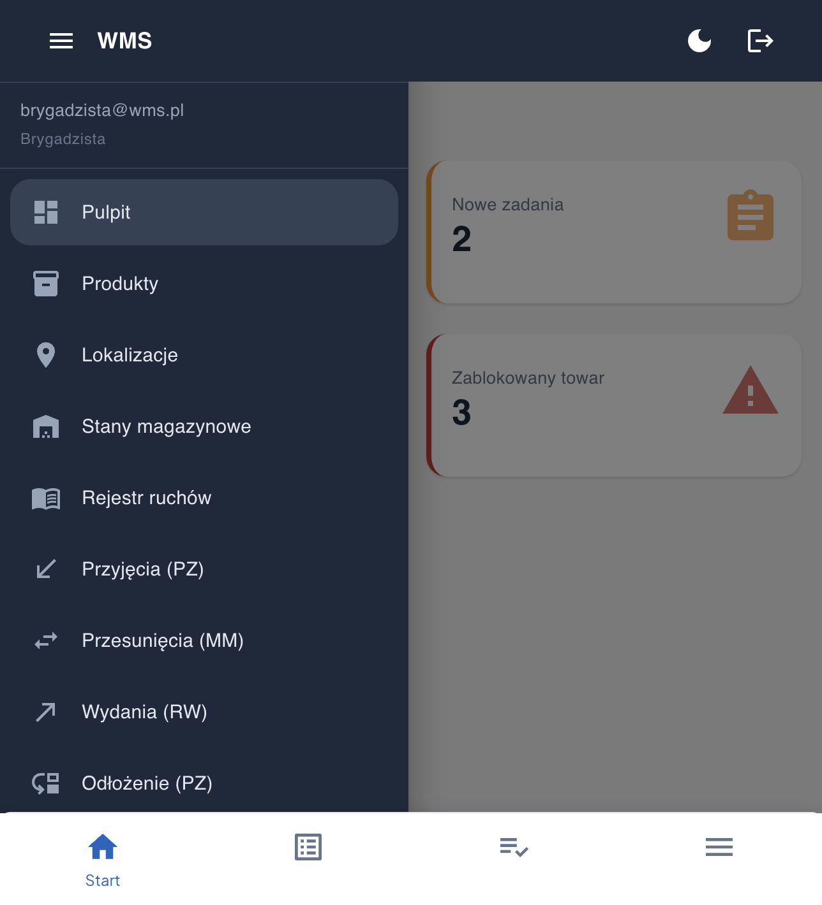

### Zadania (`/tasks`) — z możliwością tworzenia i przydziału

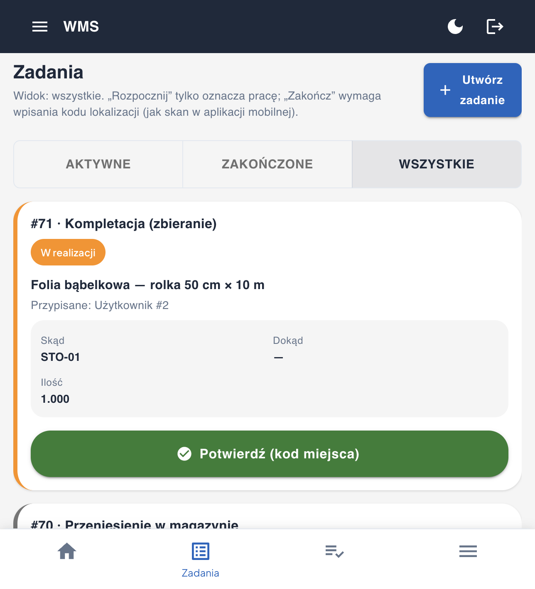

> Próba wejścia w `/users` kończy się przekierowaniem na Pulpit — brygadzista nie ma dostępu do zarządzania użytkownikami.

---

# 4. WORKER — Magazynier

**Dostęp:** wykonywanie zadań i operacji magazynowych, podgląd stanów i dokumentów, **własne** raporty. Rola operacyjna — na co dzień korzysta głównie z **aplikacji mobilnej** (skan kodów).

**Może:**
- **realizować zadania** (Rozpocznij/Potwierdź) — bez ich tworzenia,
- wykonywać operacje (odłożenie, kompletacja), podglądać stany magazynowe,
- przeglądać produkty, lokalizacje, dokumenty (poziom operacyjny),
- przeglądać **własne** raporty.

**Nie może:**
- tworzyć/zarządzać zadaniami (brak „Utwórz zadanie”),
- prowadzić inwentaryzacji (wejście w `/inventory` blokowane),
- zarządzać użytkownikami ani zmieniać ustawień systemu,
- zmieniać statusu towaru.

### Dostępne moduły (menu magazyniera — brak Inwentaryzacji, Użytkowników, Ustawień)

### Zadania (`/tasks`) — tylko realizacja, BRAK „Utwórz zadanie”

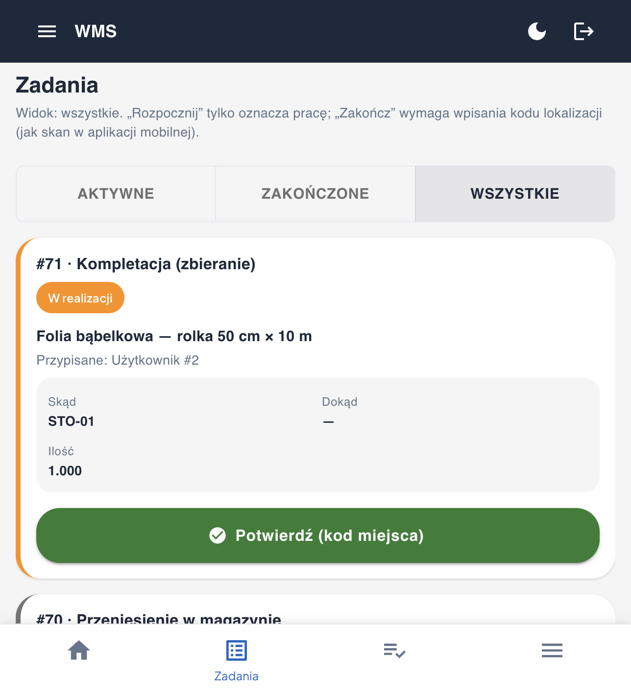

### Stany magazynowe (`/stock`) — podgląd operacyjny

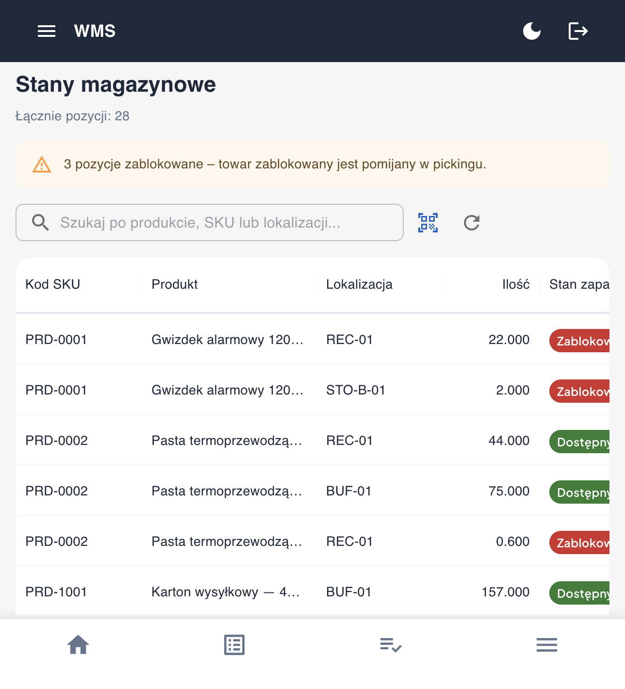

### Próba wejścia w obszary zastrzeżone (`/inventory`, `/users`, `/settings`) → blokada

Każda taka próba kończy się przekierowaniem na Pulpit:

---

# Zbiorcza mapa dostępu do ekranów

Legenda: ✅ pełny / operacyjny dostęp · 👁️ tylko podgląd · ⚙️ wykonywanie operacji · 🔒 brak (przekierowanie na Pulpit)

| Ekran / moduł | ADMIN | MANAGER | FOREMAN | WORKER |
|---|:--:|:--:|:--:|:--:|
| Pulpit | ✅ | ✅ | ✅ | ✅ |
| Produkty / Lokalizacje | ✅ | ✅ | ✅ | 👁️ |
| Stany magazynowe / Rejestr ruchów | ✅ | ✅ | ✅ | ⚙️ |
| Dokumenty PZ / MM / RW | ✅ | ✅ | ✅ | ⚙️ |
| Odłożenie / Kompletacja | ✅ | ✅ | ✅ | ⚙️ |
| Zadania – realizacja | ✅ | ✅ | ✅ | ⚙️ |
| Zadania – tworzenie/przydział | ✅ | ✅ | ✅ | 🔒 |
| Inwentaryzacja | ✅ | ✅ | ⚙️ | 🔒 |
| Raporty / Dziennik zdarzeń | ✅ | ✅ | ✅ | 👁️ (własne) |
| Użytkownicy | ✅ | 👁️ | 🔒 | 🔒 |
| Ustawienia systemu | ✅ | 🔒 | 🔒 | 🔒 |

# Wnioski

- **RBAC działa i jest spójny** — te same reguły egzekwowane są w interfejsie (ukrywanie menu + `RoleGuard`) i na backendzie (`require_permission` → HTTP 403). Nawet po ręcznym wpisaniu adresu zastrzeżonego użytkownik jest przekierowywany.
- **Zasada najmniejszych uprawnień** — każda rola ma dokładnie tyle dostępu, ile wynika z jej zadań (administracja / kierowanie / nadzór operacyjny / praca wykonawcza).
- **Rozdział obowiązków** — tworzenie kont i konfiguracja systemu są wyłącznie po stronie administratora; magazynier wykonuje, ale nie zarządza.
